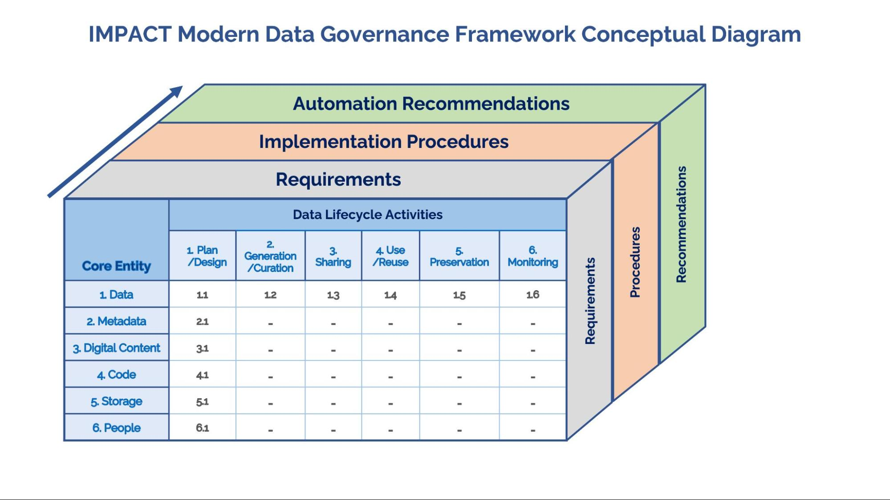

Modern Scientific Data Governance Framework
===========================================

V0.1

September 2023

Release Notes and Caveats
=========================

The development of this modern scientific data governance framework is
an ongoing process due to the ever evolving nature of policies and best
practices.

This framework was initially developed for the [Interagency Implementation and Advanced Concepts
(IMPACT)](https://impact.earthdata.nasa.gov/) project teams to
use to assess compliance with policies and Earth science community
standards. Therefore, the framework may not take into account all use
cases or data management scenarios.

Community feedback and comment on this framework are encouraged and
welcomed.

The framework is released under the [Creative
Commons Attribution 4.0
International](https://creativecommons.org/licenses/by/4.0/legalcode)
license. When using or reusing the framework, please provide attribution
to this repository.

Introduction
============

Background
----------

A Data Governance Framework serves as a template or starting point for
organizations to define and enforce policies that govern the management
of data throughout its lifecycle. Requirements and implementation
procedures captured in this document should be included in an Open
Science Management Plan for Data (i.e., OSDMP) and/or a Software
Management Plan (i.e., SMP) or a Data Management Plan (DMP) when
initiating a new IMPACT project.

### 

Current Challenges with Scientific Data Governance
--------------------------------------------------

The existing challenges in creating and maintaining a scientific data
governance framework include:

1.  Dynamic U.S. Federal mandates and compliance regulations, such as
    > the [OSTP 2022
    > memo](https://www.whitehouse.gov/wp-content/uploads/2022/08/08-2022-OSTP-Public-Access-Memo.pdf),
    > which requires free and Immediate public access to federally
    > funded research; the OPEN Government Data Act ([ class="underline">P.L.
    > 115-435](https://www.congress.gov/115/plaws/publ435/PLAW-115publ435.pdf),
    > 2019, Title II), which requires data to be in machine-readable
    > format with open licenses; the Geospatial Data Act ([ class="underline">P. L.
    > 115-254](https://www.fgdc.gov/gda/geospatial-data-act-of-2018.pdf),
    > 2018, Title F), which mandates the accessibility of geospatial
    > data; the OMB (2013) [Open Data
    > Policy](https://digital.gov/resources/open-data-policy-m-13-13/);
    > and the Federal Data Strategy [2021 Action
    > Plan](https://strategy.data.gov/2021/action-plan/) focused
    > on mature data governance and data and infrastructure maturity.

2.  Evolving organizational policies and strategies like NASA's
    > Scientific Information Policy (also known as [ class="underline">SPD-41a](https://science.nasa.gov/science-red/s3fs-public/atoms/files/SMD-information-policy-SPD-41a.pdf)),
    > which emphasizes the free and open availability of scientific
    > information in compliance with [FAIR
    > principles](https://doi.org/10.1038/sdata.2016.18).

3.  The abundance of best practices and standards to choose from,
    > Including metadata standards (STAC, UMM-C), controlled
    > vocabularies (GCMD) and guidance such as FAIR, making it
    > challenging to curate all the necessary information.

4.  Data Governance quality drift, also known as "Normalization of
    > deviation," occurs over time due to the absence of systematic Data
    > Management processes.

Vision for a Modern Data Governance Framework
---------------------------------------------

The vision for a modern Data Governance Framework involves the
following:

1.  A unified and adaptable science data governance framework that can
    > be customized by each project. This framework:

    -   Aligns with government mandates and organizational policies, and
        > can be monitored through automation.

    -   Maps policies to actual requirements, as well as recommended
        > data management procedures/tasks needed to fulfill those
        > requirements.

2.  The framework is "modern" because it:

    -   Is designed for cloud-based data management.

    -   Ensures that governance processes meet policy requirements,
        > while enabling rather than hindering the scientific process.

    -   Facilitates automation of data management tasks and monitoring
        > of the governance process, whenever possible (next step)

3.  The framework is meant to be a living document published in GitHub.
    > This allows the community to quickly push changes and adapt as
    > policies or processes change.

Governance Components
---------------------

### ***Understanding the core entities (or assets) you are managing***

-   Data - any scientific measurement. This includes Earth observation
    > data, scientific images and model output data

-   Metadata - structured information about the data,

-   Digital content - Information provided in digital documents that
    > pertain to data or the scientific process. This includes
    > documentation, algorithms, technical reports, and any ancillary
    > information or work product related to the data.

-   Code - a set of instructions used to execute computation i.e.
    > (python programs, notebooks, libraries, run scripts)

-   Software - to be revisited later

**Note:** Architecture is deemed to be out of scope for this framework
and should be included in the project management plan.

### ***Understanding the Resources you have?***

Resources are your constraints. These constraints are important to
consider as they impact governance of the assets and as such have to be
managed.

-   Storage - where data, code, metadata and information are stored (i.e
    > Object Store (S3) or On Premise)

-   People - the mDGF breaks down tasks and skill sets into two broad
    > roles. The roles are:

    -   **Data stewards** - The data steward focuses on ensuring
        > compliance to governance policies and domain specific
        > standards. In effect, the steward is responsible for
        > implementing governance policies and monitoring information
        > assets against those policies. The data steward is responsible
        > for curating metadata, gathering and organizing information,
        > adhering to open science principles and executing against the
        > Data Governance Plan.

    -   **Data engineers** - Data engineers are primarily responsible
        > for building, managing and operationalizing data pipelines The
        > data engineer is responsible for intaking, checking,
        > reprocessing data, implementing services to make data,
        > metadata, information accessible.

-   Compute - to be added later

Governance Activities 
----------------------

*Understanding the activities that you or your team will have to perform*
-------------------------------------------------------------------------

These activities can be of two types:

### ***Foundational :*** These activities are needed by all projects and inform the data lifecycle

-   Planning and Design - *plan & design what needs to be done for your
    > project at each lifecycle phase*

    -   Determine appropriate lifecycle phases

    -   Align with requirements and policies

    -   Must consider external constraints such as architecture and
        > other resources (people, costs, storage)

-   Monitoring - *periodic assessment of the entities being managed as
    > well as the entire governance process*

    -   Metrics

    -   Quality

    -   Security (access controls)

    -   Resources

***Data LifeCycle*** : These activities are implemented at each phase of
the data lifecycle

-   **Generation/Curation** - activities associated with collecting,
    > creating, producing, acquiring, and curating core entities. These
    > activities include: Collection, Creation, Production, Acquisition,
    > Curation, Ingestion, Storage

    -   **Data collection** is the systematic process of gathering and
        > measuring information on targeted variables in an established
        > system, which enables one to answer relevant questions and
        > evaluate outcomes.

    -   **Data creation** refers to the process of producing new data or
        > information that didn't exist before. In scientific research,
        > data creation could refer to the process of conducting
        > experiments or observations that generate new data.

    -   **Data production** refers to the processes and methods involved
        > in generating and preparing data for use in analysis.

    -   **Data acquisition** refers to the process of gathering,
        > filtering, and cleaning data from various sources to be used
        > for data analysis or decision-making purposes. The process
        > involves collecting raw data from within the system or from
        > external sources, transforming it into usable data, and
        > loading it into a structured form for further analysis or
        > processing.

    -   **Data curation** refers to the process of organizing,
        > integrating, cleaning, and enhancing raw data to create
        > high-quality datasets that are easy to use and can be trusted
        > to support decision-making, research, and analysis.

    -   **Data ingestion** refers to the process of importing,
        > transferring, loading, and processing data for later use or
        > storage in a structured form. This process involves taking raw
        > data from various sources and bringing it into a system where
        > it can be analyzed and used to inform decision-making.

    -   **Data storage** refers to the use of recording media to retain
        > digital data within a data storage device.

-   **Sharing** - activities associated with making the core entities
    > discoverable and accessible. Activities include:

    -   Publication of entities to an open, searchable catalog or a
        > repository

    -   Dissemination/communication of information to stakeholders

    -   Ensuring access to the core entities

-   **Use/Reuse** - activities associated with making core entities
    > usable to stakeholders. Activities for interacting with the core
    > entities include:

    -   Exploration - data, metadata, information, code

    -   Execution - code

    -   Analysis - data, metadata

    -   Visualization - data

-   **Preservation** - activities associated with long term care of the
    > core entities. Activities include:

    -   Archiving

    -   Maintenance

    -   Disposal

The mDGF structure and the numbering system can be summarized at the
high-level in a tabulated way:

<table>
<thead>
<tr class="header">
<th></th>
<th>
<strong>1</strong>

<strong>Plan/Design</strong>
</th>
<th>
<strong>2</strong>

<strong>Gen/Curation</strong>
</th>
<th>
<strong>3</strong>

<strong>Sharing</strong>
</th>
<th>
<strong>4.</strong>

<strong>Use/Reuse</strong>
</th>
<th>
<strong>5</strong>

<strong>Preservation</strong>
</th>
<th>
<strong>6 </strong>

<strong>Monitoring</strong>
</th>
</tr>
</thead>
<tbody>
<tr class="odd">
<td><strong>1 Data</strong></td>
<td>1.1</td>
<td>1.2</td>
<td>1.3</td>
<td>1.4</td>
<td>1.5</td>
<td>1.6</td>
</tr>
<tr class="even">
<td><strong>2 Metadata</strong></td>
<td>2.1</td>
<td>..</td>
<td>..</td>
<td>..</td>
<td>..</td>
<td>..</td>
</tr>
<tr class="odd">
<td><strong>3 Digital Content</strong></td>
<td>3.1</td>
<td>..</td>
<td>..</td>
<td>..</td>
<td>..</td>
<td>..</td>
</tr>
<tr class="even">
<td><strong>4 Code</strong></td>
<td>4.1</td>
<td>..</td>
<td>..</td>
<td>..</td>
<td>..</td>
<td>..</td>
</tr>
<tr class="odd">
<td><strong>5 Storage</strong></td>
<td>5.1</td>
<td>..</td>
<td>..</td>
<td>..</td>
<td>..</td>
<td>..</td>
</tr>
<tr class="even">
<td><strong>6 People</strong></td>
<td>6.1</td>
<td>..</td>
<td>..</td>
<td>..</td>
<td>..</td>
<td>..</td>
</tr>
</tbody>
</table>

Or as a 3-dimensional diagram:

How to use the mDGF?
--------------------

-   Review and understand the structure and the numbering system for
    > each section. The high-level sections are organized by core
    > entities (data, metadata, digital content and code) and resources
    > (storage and people). Each section is broken down by foundational
    > and data lifecycle activities (planning, monitoring, etc…).

<!-- -->

-   The framework consists of two parts that are mapped to each other

    -   Requirements

    -   Procedures (Data Management Tasks). Each procedure is assigned
        > to a role, either a Data Steward (DS) or a Data Engineer (DE)
        > or both (DS + DE).

    -   *More specific details on the automation recommendations will be
        > provided in upcoming versions of the mDGF.*

-   Use [cookiecutter-mdgf](https://github.com/NASA-IMPACT/cookiecutter-mdgf) to
    > tailor it for your individual project

    -   Select the entities (and constraints) applicable to your project

    -   Select the data life cycle phases that apply to your project.
        > Remember Foundational Phases are recommended as mandatory
        > requirements.

    -   Performance a quick compliance check against the different
        > policies (SPD-41a, FAIR) etc.

    -   Export the subset as:

        -   Document which will serve as your DMP

        -   Github into your project repo as cards
