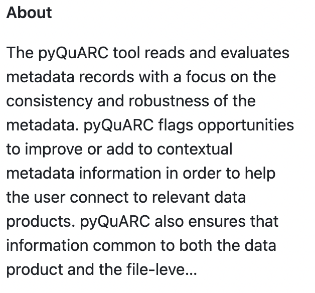

## **4.3 Sharing**

<table>
    <thead>
        <tr class="header">
            <th><strong>Requirement</strong></th>
            <th><strong>Procedure</strong> [Role - Data Steward (DS) or Data Engineer (DE)]</th>
        </tr>
    </thead>
    <tbody>
        <tr class="odd">
            <td>A4.3.1 Ensure that the code is openly accessible</td>
            <td>B4.3.1Ensure the code repository is set to ‘public’ in GitHub. [DE]</td>
        </tr>
        <tr class="even">
            <td>A4.3.2 Ensure that the code has a persistent identifier and is discoverable with the data</td>
            <td>
                
B4.3.2a The code repository should be assigned a registered persistent identifier. <a href="https://docs.github.com/en/repositories/archiving-a-github-repository/referencing-and-citing-content">Use Zenodo</a> for assigning a new DOI. In rare cases that a DOI has been assigned via other mechanisms, ensure the DOI is uploaded to the repo. [DS]

                
B4.3.2b Ensure the code identifier is added to the data product metadata. [DS]

                
B4.3.2c Ensure the DOI is added to the Github citation file [DS + DE]

            </td>
        </tr>
        <tr class="odd">
            <td>A4.3.3 Ensure the code is documented</td>
            <td>
                
B4.3.3a Include a read me document that describes the purpose of the code and any system requirements [DE]

                
B4.3.3b Include a brief ‘About’ description of the code that will be displayed towards the top of the repo page. The description should be no more than 325 characters or 50 words. [DS]

                
Example ‘About’ text. 

            </td>
        </tr>
    </tbody>
</table>
