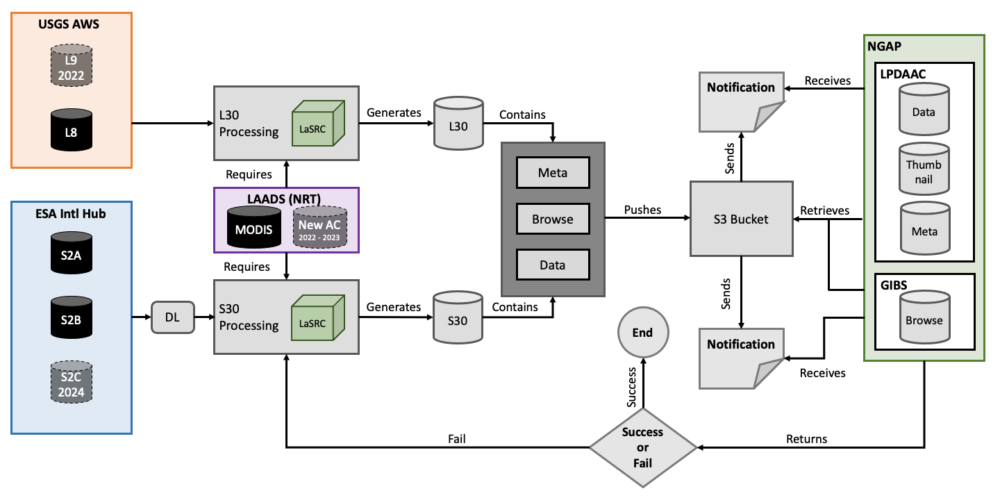

**1.1 Planning and Design**
-----------------------

<table>
<thead>
<tr class="header">
<th><strong>Requirement</strong></th>
<th><strong>Procedure</strong> [Role - Data Steward (DS) or Data Engineer (DE)]</th>
</tr>
</thead>
<tbody>
<tr class="odd">
<td>A1.1.1 Define a data flow diagram with the purpose of identifying data sources and touchpoints for the project and for communicating to data users how data was handled.</td>
<td>
B1.1.1 Create a data flow diagram extending from acquisition/creation to user delivery and add diagram to DMP. [DE]

Example diagram: 
</td>
</tr>
<tr class="even">
<td>A1.1.2 Develop touchpoint agreements identified in the data flow diagram</td>
<td>B1.1.2 Create needed touchpoint agreements such as Interface Control Documents, (ICDs) / Submission Agreement (SA), Memorandum of Understanding (MOU),or Service Level Agreement (SLA). [DS + DE]</td>
</tr>
<tr class="odd">
<td>A1.1.3 Adhere to community accepted standard machine readable data file formats</td>
<td>
B1.1.3 Select standard machine-readable data file format(s) from <a href="https://www.earthdata.nasa.gov/esdis/esco/standards-and-practices#data-formats">NASA Approved Data Formats</a> [DS]

<ul>
<li><blockquote>

The <a href="https://doi.org/10.5067/DOC/ESO/DPDG_QSG_VERSION1">EOSDIS Data Product Development Guide for Data Producers - Quick Start Guide</a> prefers the following data formats: netCDF-4 and GeoTIFF.

</blockquote></li>
<li><blockquote>

Cloud Optimized GeoTIFF (COG) and Zarr are the preferred Cloud-based formats

</blockquote></li>
</ul></td>
</tr>
<tr class="even">
<td>A1.1.4 Identify and document all data product characteristics</td>
<td>B1.1.4 Create a data sheet using the following template: <a href="https://docs.google.com/document/d/1FqAPO0jwMk7rzxJTkHFuOpwOvHviQDW2/edit#heading=h.gjdgxs">Data Sheet Template</a><em>.</em> Add additional data characteristics as needed for each project. [DS]</td>
</tr>
<tr class="odd">
<td>A1.1.5 Adhere to community best practice(s) on data file naming conventions</td>
<td>B1.1.5 Define and document file naming conventions using following guidelines: <a href="https://ghrc.nsstc.nasa.gov/home/sites/default/files/GHRC_naming_convention.pdf">GHRC File Naming convention</a> [DS]</td>
</tr>
<tr class="even">
<td>A1.1.6 Adhere to community standard variable names, types, and unit(s), keywords</td>
<td>B1.1.6 Utilize standard variable(s), types, and unit(s) such as <a href="http://cfconventions.org/">CF convention  </a>[DS]</td>
</tr>
<tr class="odd">
<td>A1.1.7 Adhere to community standards for coordinate systems</td>
<td>
B1.1.7 Utilize coordinate reference systems (CRS) from this list (<a href="https://epsg.io/">https://epsg.io/</a>) [DE]

<ul>
<li><blockquote>

Recommended global CRS:

</blockquote>
<ul>
<li><blockquote>

2-dimensional World Geodetic System 1984 (WGS 84) (Lat/Long): <a href="https://epsg.io/4326">EPSG:4326</a>

</blockquote>
<ul>
<li><blockquote>

WGS 84 World Mercator: <a href="https://epsg.io/3395">EPSG:3395</a>

</blockquote></li>
<li><blockquote>

WGS 84 Pseudo-Mercator: <a href="https://epsg.io/3857">EPSG:3857</a>

</blockquote></li>
</ul></li>
<li><blockquote>

3-dimensional WGS 84 (Lat/Long/Elevation): <a href="https://epsg.io/4979">EPSG:4979</a>

</blockquote></li>
</ul></li>
<li><blockquote>

Recommended CRS for data over polar regions:

</blockquote>
<ul>
<li><blockquote>

WGS 84 Arctic Polar Stereographic: <a href="https://epsg.io/3995">EPSG:3995</a>

</blockquote>
<ul>
<li><blockquote>

NSIDC Sea Ice Polar Stereographic North: <a href="https://epsg.io/3413">EPSG:3413</a>

</blockquote></li>
<li><blockquote>

NSIDC Sea Ice Polar Stereographic South: <a href="https://epsg.io/3976">EPSG:3976</a>

</blockquote></li>
</ul></li>
</ul></li>
</ul></td>
</tr>
<tr class="even">
<td>A1.1.8 Adhere to community standards for map projections</td>
<td>B1.1.8 Utilize map projections from this list (<a href="https://epsg.io/">https://epsg.io/</a>) [DE]</td>
</tr>
<tr class="odd">
<td>A1.1.9 Adhere to community standards for date and time formats</td>
<td>B1.1.9 Utilize data and time formatting from <a href="https://www.w3.org/TR/NOTE-datetime">ISO 8601</a> [DE]</td>
</tr>
<tr class="even">
<td>A1.1.10 Define a data product versioning scheme</td>
<td>B1.1.10 Represent the data product version with an ordinal identifier (e.g., 1, 2, 3, etc.) that expresses its position in a series of data product publications. The data product version can be represented with both a major and minor version identifier (e.g., 2.1, 2.2, etc.). (Reference: see Section 4.3 of the <a href="https://www.earthdata.nasa.gov/s3fs-public/2022-06/ESDS-RFC-041-DPDG_V1.1-20220516_0.pdf?VersionId=0gPInlDI2oyQMh.RNC3e87qEnwcBdJzm">Data Product Development Guide for Data Producers</a>) [DE]</td>
</tr>
<tr class="odd">
<td>A1.1.11 Define a science quality evaluation plan for data products</td>
<td>
B1.1.11 Develop the characteristics of the science quality evaluation needed for each data product [DS]

Suggested:

<ul>
<li><blockquote>

Univariate visualization of each field in the raw dataset, with summary statistics and Fill Values, Mask Values

</blockquote></li>
</ul></td>
</tr>
<tr class="even">
<td>A1.1.12 Develop a data retention plan including a process for when and how data will be sunset</td>
<td>B1.1.12 Create a data retention plan that includes information about the end of project preservation plan and rolling archive plans. Use the <a href="https://docs.google.com/document/d/1nWOkkKoICDhb9VWcZF7cvp31pjtZyRP1VM3wqNj4HHo/edit">CSDA data retirement policy template</a> as needed. [DS]</td>
</tr>
<tr class="odd">
<td>
A.1.1.13 Define metrics to be collected along the following dimensions:

<ul>
<li><blockquote>

Data use (search and access)

</blockquote></li>
<li><blockquote>

Data quality

</blockquote></li>
<li><blockquote>

Data/information (quality) profile

</blockquote></li>
<li><blockquote>

Data Processing

</blockquote></li>
<li><blockquote>

Ingest

</blockquote></li>
<li><blockquote>

Data Access APIs/Services

</blockquote></li>
</ul></td>
<td>
B1.1.13 Develop a metrics implementation plan. [DE]

Recommended minimum metrics:

<blockquote>

<strong>Data Use Metrics</strong>

</blockquote>
<ul>
<li><blockquote>

Data Product Search frequency

</blockquote></li>
<li><blockquote>

S3 Bucket Access frequency

</blockquote></li>
<li><blockquote>

Data download counts

</blockquote></li>
</ul>
<blockquote>

<strong>Information/Data Profile</strong>:

</blockquote>
<ul>
<li><blockquote>

Data completeness

</blockquote></li>
<li><blockquote>

Metadata completeness

</blockquote></li>
<li><blockquote>

Data lineage completeness

</blockquote></li>
</ul>
<blockquote>

<strong>Data Quality</strong>

</blockquote>
<ul>
<li><blockquote>

Checksum validation

</blockquote></li>
</ul>
<blockquote>

<strong>Data Processing</strong>

</blockquote>
<ul>
<li><blockquote>

Processing time

</blockquote></li>
<li><blockquote>

Processing throughput

</blockquote></li>
<li><blockquote>

Error rate

</blockquote></li>
<li><blockquote>

Resource utilization

</blockquote></li>
</ul>
<blockquote>

<strong>Ingest</strong>:

</blockquote>
<ul>
<li><blockquote>

Ingest rate

</blockquote></li>
<li><blockquote>

Ingest completeness / volume

</blockquote></li>
<li><blockquote>

Ingest error rate

</blockquote></li>
</ul>
<blockquote>

<strong>Data Access APIs/Services</strong>:

</blockquote>
<ul>
<li><blockquote>

Service availability

</blockquote></li>
<li><blockquote>

Service usage

</blockquote></li>
<li><blockquote>

Service response time

</blockquote></li>
<li><blockquote>

Service error rate

</blockquote></li>
</ul></td>
</tr>
<tr class="even">
<td>A1.1.14 Identify the most appropriate data license for the data product</td>
<td>B1.1.14 If there are no other restrictions, SMD scientific data should be released with a Creative Commons Zero license. [DS]</td>
</tr>
<tr class="odd">
<td>A1.1.15 Determine content and format for the dataset landing page</td>
<td>
B1.1.15 Design dataset landing page format and content. Recommend using the <a href="https://docs.google.com/document/d/1qEoqYMh6K0QjY4HFqJ55yinwn4u0s22j88IAED583_U/edit?usp=sharing">IMPACT data product landing page design</a>. [DS]

Note that dataset landing pages can be automatically generated using UMM metadata (published to CMR) and STAC metadata (using STAC Browser). All information needed in the dataset landing page should be included in the metadata.
</td>
</tr>
<tr class="even">
<td>A1.1.16 Determine whether API-based data access is needed &amp; if so, identify an API standard</td>
<td>
B1.1.16a Refer to your system design as to whether an API-based data access is needed. [DE] For example, databases that store vector data should have an API.

B1.1.16b If an API doesn’t already exist for the data being distributed, select an appropriate <a href="https://ogcapi.ogc.org/">OGC API standard</a> to use (also see Requirement A1.4.2). For raster and map content, use <a href="https://ogcapi.ogc.org/maps/">OGC API - Maps</a>. For vector and tile data, use <a href="https://ogcapi.ogc.org/tiles/">OGC API - Tiles</a>. Also consider using <a href="https://ogcapi.ogc.org/features/overview.html">OGC API - Features</a> as needed.[DE]
</td>
</tr>
</tbody>
</table>
